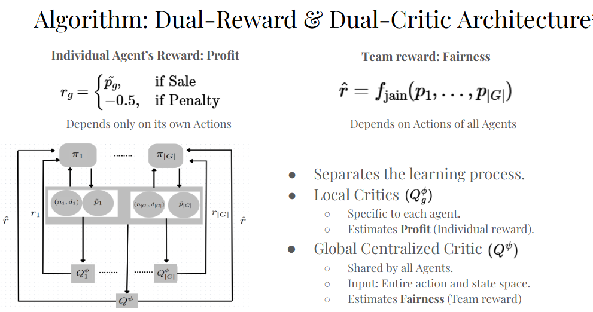

# FairSwarm: Cooperative Multi-Agent Reinforcement Learning for Fair Dynamic Pricing

Official implementation of **“Cooperative Multi-Agent Reinforcement Learning for Fair Dynamic Pricing,”** published in the proceedings of the 14th Computing Conference 2026, London, UK.

Developed by **Vishwanath Vinod** under the guidance of **Prof. Rachel Kalpana Kalaimani** as an Undergraduate Research Project at the Indian Institute of Technology Madras (IIT Madras).

## Paper

* **Authors:** Vishwanath Vinod, Rachel Kalpana Kalaimani
* **Conference:** 14th Computing Conference, 9–10 July 2026
* **Publication:** *Intelligent Computing*, Springer, 2026
* **Paper:** [Proceedings of Computing Conference](https://link.springer.com/chapter/10.1007/978-3-032-24804-6_11)

## Overview

Dynamic pricing optimizes revenue by adjusting prices for each customer group based on their demand functions. However, this can lead to different prices for the same product across groups, potentially enabling unintended price discrimination. This becomes a malicious problem if pricing decisions exploit latent sensitive attributes such as race, gender, or ethnicity. **FairSwarm** introduces a cooperative multi-agent reinforcement learning framework that jointly optimizes profitability and fairness across customer groups. 

The approach extends decomposed Multi-Agent Deep Deterministic Policy Gradient (MADDPG) through:

* **Local critics** that optimize individual group profits.
* **A global fairness critic** that promotes fairness (equitable prices) using Jain’s Fairness Index.
* **A dual-reward learning objective** that jointly incorporates individual profitability and group-level fairness.
* **A tunable control parameter** that adjusts the trade-off between fairness and profitability, enabling flexible prioritization of the two objectives.

The framework is evaluated in simulated dynamic-pricing environments with varying numbers of customer groups.
## Architecture

<p align="center">
  
</p>

*Overview of the proposed cooperative multi-agent learning framework.*

## Experimental Setup

| Parameter         | Setting       |
| ----------------- | ------------- |
| Customer groups   | 2, 4, 6       |
| Price range       | 100–500       |
| Customers         | 600 per group |
| Initial inventory | 300 per group |
| Training episodes | 1,000         |

The dual-reward formulation and its trade-off between fairness and profitability are evaluated against existing reinforcement learning baselines. See the paper for detailed results and experimental analysis.

## Repository Structure

```text
.
├── customer.py          # Customer interactions and influx
├── demand.py            # Group-specific demand functions
├── env.py               # Custom Gym environment
├── networks.py          # Actor and critic networks
├── dec_maddpg_dual.py   # Dual-reward decomposed MADDPG
├── fairness_metric.py   # Fairness metrics
├── replay_buffer.py     # Experience replay
├── noise.py             # OU exploration noise
├── plot_fairness.py     # Fairness–profit visualizations
└── main.py              # Training and experiments
```

## Getting Started

```bash
git clone <REPOSITORY_URL>
cd <REPOSITORY_NAME>
pip install -r requirements.txt
```

Run the training and evaluation scripts using the configurations specified in the code.

## Citation

If you use this work, please cite:

```bibtex
@InProceedings{10.1007/978-3-032-24804-6_11,
  author    = {Vinod, Vishwanath and Kalaimani, Rachel Kalpana},
  title     = {Cooperative Multi-agent Reinforcement Learning for Fair Dynamic Pricing},
  booktitle = {Intelligent Computing},
  editor    = {Arai, Kohei and Lorenz, Pascal},
  publisher = {Springer Nature Switzerland},
  year      = {2026},
  pages     = {188--205},
  address   = {Cham},
  isbn      = {978-3-032-24804-6},
  doi       = {10.1007/978-3-032-24804-6_11}
}
```

## License

MIT License

Copyright (c) 2023 Intelligent Data Science Lab

Permission is hereby granted, free of charge, to any person obtaining a copy
of this software and associated documentation files (the "Software"), to deal
in the Software without restriction, including without limitation the rights
to use, copy, modify, merge, publish, distribute, sublicense, and/or sell
copies of the Software, and to permit persons to whom the Software is
furnished to do so, subject to the following conditions:

The above copyright notice and this permission notice shall be included in all
copies or substantial portions of the Software.

THE SOFTWARE IS PROVIDED "AS IS", WITHOUT WARRANTY OF ANY KIND, EXPRESS OR
IMPLIED, INCLUDING BUT NOT LIMITED TO THE WARRANTIES OF MERCHANTABILITY,
FITNESS FOR A PARTICULAR PURPOSE AND NONINFRINGEMENT. IN NO EVENT SHALL THE
AUTHORS OR COPYRIGHT HOLDERS BE LIABLE FOR ANY CLAIM, DAMAGES OR OTHER
LIABILITY, WHETHER IN AN ACTION OF CONTRACT, TORT OR OTHERWISE, ARISING FROM,
OUT OF OR IN CONNECTION WITH THE SOFTWARE OR THE USE OR OTHER DEALINGS IN THE
SOFTWARE.
